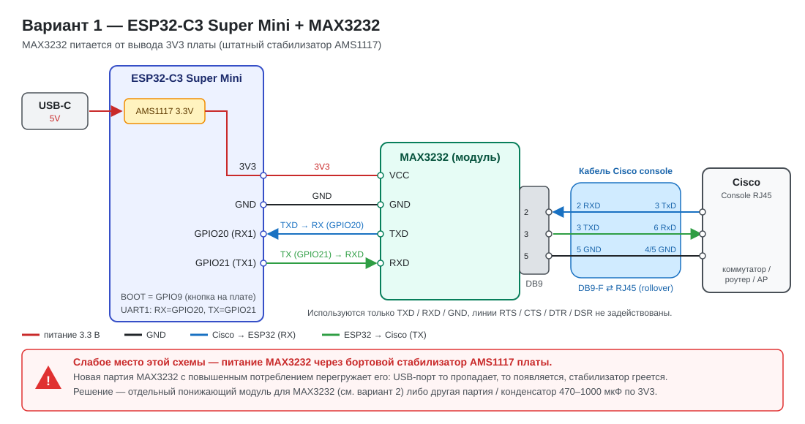
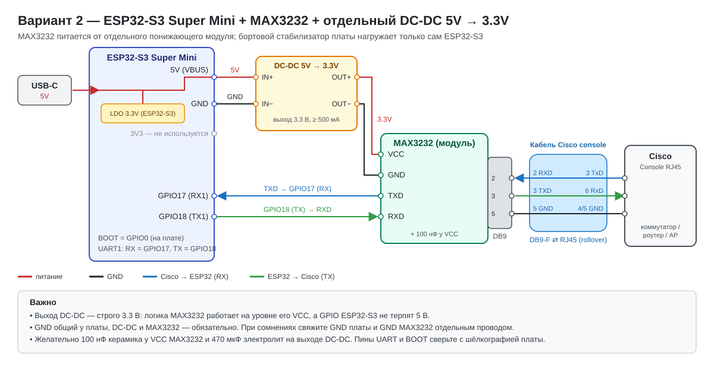

# ESP32 Cisco Console Server (ESP32-C3 / ESP32-S3)

A remote COM port for console access to network equipment (Cisco and compatible) over Wi-Fi. An ESP32 + MAX3232 turn a device's local console port into a TCP socket reachable over the network — no need to physically plug a laptop into every switch, router or access point.

Two hardware variants share the same firmware logic:

| | Variant 1 | Variant 2 |
|---|---|---|
| Board | ESP32-C3 Super Mini | ESP32-S3 Super Mini |
| Sketch | `esp32-tcp-com.ino` | `esp32-tcp-com-s3.ino` |
| MAX3232 power | from the board's 3V3 (onboard AMS1117) | from a separate 5V → 3.3V DC-DC module |
| UART pins | RX1 = GPIO20, TX1 = GPIO21 | RX1 = GPIO17, TX1 = GPIO18 |
| BOOT button | GPIO9 | GPIO0 |
| Fallback AP name | `ESP32-Console` | `ESP32-S3-Console` |
| Wiring diagram | `schema-esp32-c3-max3232.svg` | `schema-esp32-s3-max3232-dcdc.svg` |

> 🤖 The firmware and web portal were built together with **Claude** (Anthropic) — from the first version of the bridge to the security layers, dark theme, WPA2-Enterprise, portal password and WireGuard page.

## Features

- **TCP ⇄ UART bridge** on port `8888` (default), with buffered block transfer, minimal Telnet negotiation (`IAC WILL ECHO`) so clients don't duplicate typed commands, and CR LF / CR NUL collapsed into a single CR (fixes the doubled prompt on Enter).
- **Single active session** — a second connection attempt gets `BUSY` until the first one is closed (or kicked from the web portal).
- **Session password** — optional; the client sees `Password:` and every typed character is echoed as `*` (Backspace supported).
- **Web portal** on port `80`, dark theme, **RU/EN** switch, MAC address shown in both AP and STA mode.
- **Portal password** — optional HTTP Basic Auth (user `admin`); can reuse the console session password or be set separately. Not applied on the initial access-point setup portal.
- **Configurable UART speed** (1200–115200 baud) — applied live, no reboot.
- **Fallback access point** at `192.168.4.1` when the target Wi-Fi is unreachable or not configured.
- **Wi-Fi setup via the portal** — scan networks, pick an SSID or type one manually (hidden networks), regular password or **WPA2-Enterprise (802.1X, PEAP/MSCHAPv2)**.
- **Network White List** by IP/CIDR and optional **Static IP**.
- **WireGuard VPN client** page (`/vpn`) — lets the device dial out to your own WireGuard server so the console is reachable without a third-party VPN client (requires an extra library, see below).
- **BOOT-button reset** — hold BOOT for 5 seconds to wipe the Wi-Fi settings and the portal password and reboot into the passwordless setup AP.
- **Radio retry** — if the first Wi-Fi attempt fails, the radio is powered off/on and retried before falling back to AP.
- **Reduced TX power** (`WIFI_POWER_8_5dBm`) to cut peak current on boards with marginal power delivery.
- **Optional IP lockout** after 3 wrong password attempts (`#define USE_BAN_LIST`).
- All settings live in **NVS** and survive reboots and reflashing.

## Hardware

Common parts: ESP32 Super Mini board, a MAX3232 (RS-232 ⇄ TTL) module with DB9, and a Cisco console cable (DB9-F ⇄ RJ45).

### Variant 1 — ESP32-C3 Super Mini



| ESP32-C3 | MAX3232 module |
|---|---|
| GPIO20 (RX1) | TXD |
| GPIO21 (TX1) | RXD |
| 3V3 | VCC |
| GND | GND |

The MAX3232 is powered from the board's own AMS1117. This works with some MAX3232 batches, but a batch with higher supply current can overload the regulator: the USB port keeps disappearing and reappearing, and the AMS1117 gets hot. If that happens, use Variant 2's power scheme (or add a 470–1000 µF capacitor on 3V3 as a partial mitigation).

### Variant 2 — ESP32-S3 Super Mini + separate DC-DC



| ESP32-S3 | Connects to |
|---|---|
| 5V (VBUS) | DC-DC IN+ |
| GND | DC-DC IN− |
| GPIO17 (RX1) | MAX3232 TXD |
| GPIO18 (TX1) | MAX3232 RXD |
| — | DC-DC OUT+ → MAX3232 VCC, OUT− → MAX3232 GND |

- The DC-DC output must be **exactly 3.3 V**: the MAX3232 logic level equals its VCC, and ESP32-S3 GPIOs are not 5 V tolerant.
- GND must be common between the board, the DC-DC module and the MAX3232 (if in doubt, add a direct GND wire between the board and the MAX3232).
- Recommended: 100 nF ceramic at MAX3232 VCC and 470 µF electrolytic on the DC-DC output.
- The GPIO17/18/0 assignments are typical safe choices — **check them against the silkscreen of your particular board** and change `RX1_PIN`, `TX1_PIN`, `BOOT_BUTTON_PIN` in the sketch if needed.

### Console connection

Only TXD / RXD / GND are used; RTS / CTS / DTR / DSR are not wired. Cisco console cable mapping: DB9 pin 2 ↔ RJ45 pin 3, DB9 pin 3 ↔ RJ45 pin 6, DB9 pin 5 ↔ RJ45 pin 4/5.

## Installation

1. Install the **ESP32 by Espressif** board package in Arduino IDE (or PlatformIO). `WiFi.h`, `WebServer.h` and `Preferences.h` are part of the core.
2. Install the **WireGuard-ESP32-Arduino** library (Sketch → Include Library → Add .ZIP Library). The sketches `#include <WireGuard-ESP32.h>`, so they will not compile without it. If the original library fails on a recent Arduino core (`tcpip_adapter.h` error), use a maintained fork.
3. Open the sketch for your variant and select the board (**ESP32C3 Dev Module** or **ESP32S3 Dev Module**; for S3 enable *USB CDC On Boot* if you want Serial over USB).
4. Optionally change the seed defaults at the top of the file:
   ```cpp
   const char* DEFAULT_SSID     = "your_ssid";
   const char* DEFAULT_PASSWORD = "your_password";
   const char* apSsid     = "ESP32-Console";   // "ESP32-S3-Console" in the S3 sketch
   const char* apPassword = "console1234";
   ```
   These are only initial values; settings saved through the portal live in NVS.
5. Upload the firmware.

## First boot

- If the target network is unreachable or not configured, the device starts its own network (`ESP32-Console` / `ESP32-S3-Console`, password `console1234`) at **`192.168.4.1`**.
- Connect to it and open `http://192.168.4.1` — no login at this stage.
- Open **Wi-Fi**, scan, pick your network, enter the password (or switch to WPA2-Enterprise) and save. The device reboots and connects.

## Web portal

| Page | Purpose |
|---|---|
| `/` | status: network mode, security type, MAC address, session, traffic, uptime |
| `/settings` | session password, portal password, White List, Static IP, UART speed |
| `/wifi` | scan/select network, regular or WPA2-Enterprise, UART speed, Wi-Fi reset |
| `/vpn` | WireGuard client: keys, endpoint, tunnel IP |

The language is switched with the button in the top-right corner. Once the device is on a real network, set a portal password on `/settings`; if you forget it, hold BOOT for 5 seconds (see above).

## Connecting to the console

```bash
telnet <device-ip> 8888
# or
nc <device-ip> 8888
```

With the session password enabled the device sends `AUTH_REQUIRED` followed by `Password: `.

For PuTTY use the **Telnet** connection type, not Raw, so the client honours the echo negotiation and doesn't duplicate what you type.

> `show running-config` stopping at `--More--` is normal IOS pagination, not a bridge fault — use `terminal length 0`. And 9600 baud really is slow (~960 bytes/s); raise it on the device with `line con 0` → `speed 115200` and then in the portal.

## WPA2-Enterprise

On `/wifi` choose "WPA2-Enterprise (802.1X)" and fill in Identity, Username and Password. Only PEAP/MSCHAPv2 without CA certificate validation is supported; networks requiring EAP-TLS or strict server-certificate checks won't work without further changes.

## WireGuard

On `/vpn` enter your own WireGuard server details: the device's private key (`wg genkey`), the server's public key, endpoint and port, and the device's tunnel IP (e.g. `10.0.0.2`). The tunnel starts after a successful Wi-Fi connection and immediately after saving. Notes:
- The keepalive field is stored but not yet applied to the tunnel (the setter name depends on the library fork).
- `begin()` only returns success/failure, so a non-starting tunnel is debugged from the Serial monitor by elimination (keys, port, server-side peer entry).
- Verify on site that TCP 8888 and 80 are reachable through the tunnel IP.

## Compile-time options

```cpp
// #define USE_BAN_LIST
```

Uncomment for a one-hour IP lockout after 3 wrong session-password attempts.

## Troubleshooting

- **USB port keeps appearing/disappearing, board hot near the regulator** — the MAX3232 is overloading the onboard AMS1117. Power the MAX3232 from a separate 3.3 V DC-DC (Variant 2 scheme).
- **Access point invisible or unstable Wi-Fi on cheap boards** — power sag on TX bursts. The firmware already lowers TX power and retries the radio; a 470–1000 µF capacitor on 3V3/GND helps further.
- **`[DEBUG] BOOT button pressed` in the Serial log without touching the button** — the BOOT pin isn't behaving as a clean input on your board (GPIO9 on C3 and GPIO0 on S3 are strapping pins). These debug lines are temporary and can be removed from `checkBootButtonReset()`.
- **Cisco console silent** — check TX/RX orientation first. Some devices are picky about USB-serial chips (an FTDI cable may work where a CH340 doesn't, since CH340 modules often lack DTR/RTS pins); a loopback RTS↔CTS / DTR↔DSR at the console connector is a known workaround. Also try another unit — a faulty console port on the device itself is possible.

## Security notes

- Session, portal, Wi-Fi/Enterprise and WireGuard private-key values are stored in NVS in plain text and shown in the portal — meant for a trusted network, not direct internet exposure.
- The portal has no password by default; set one on `/settings` once you've left the setup AP.
- Anyone with physical access can wipe Wi-Fi settings and the portal password with the BOOT button — intentional recovery path.
- Scanning for Wi-Fi networks blocks the bridge and portal for a few seconds.

## Files

`esp32-tcp-com.ino` (C3), `esp32-tcp-com-s3.ino` (S3), `schema-esp32-c3-max3232.svg`, `schema-esp32-s3-max3232-dcdc.svg`, `README.md`, `README_ru.md`.

## License

Use, modify and share freely — built for a personal home/office infrastructure project.
